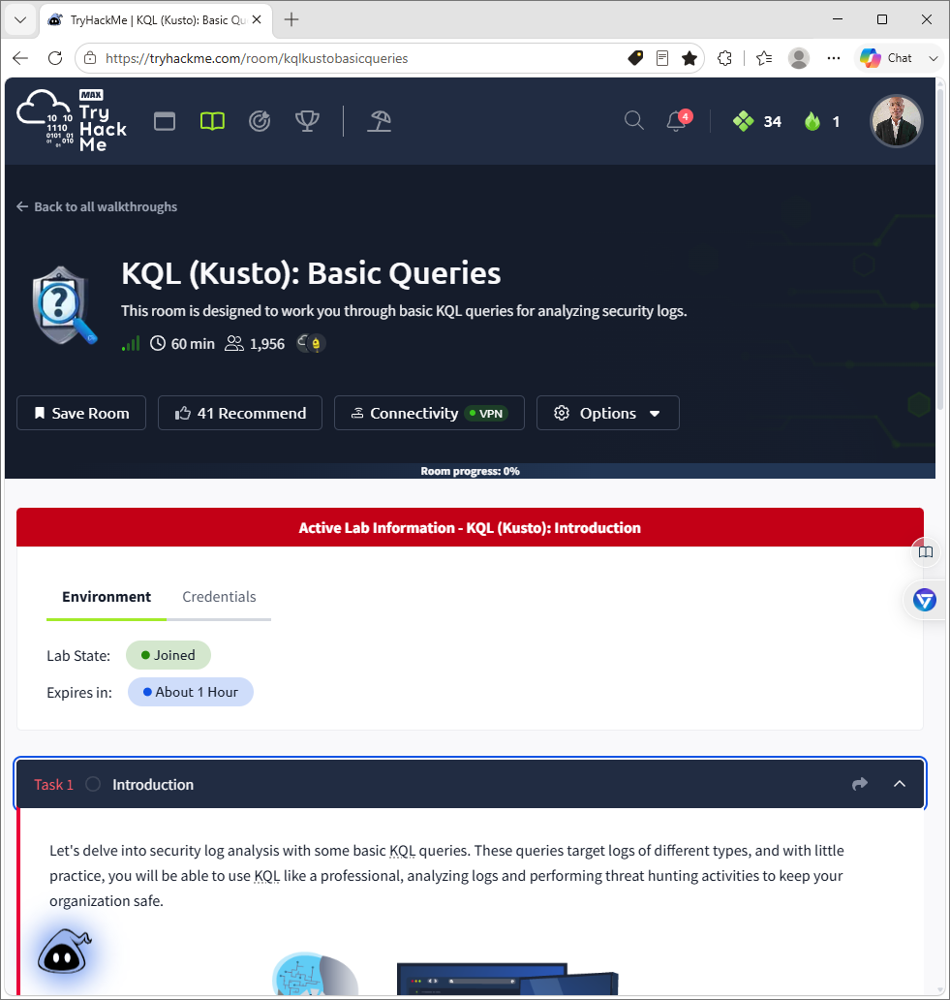
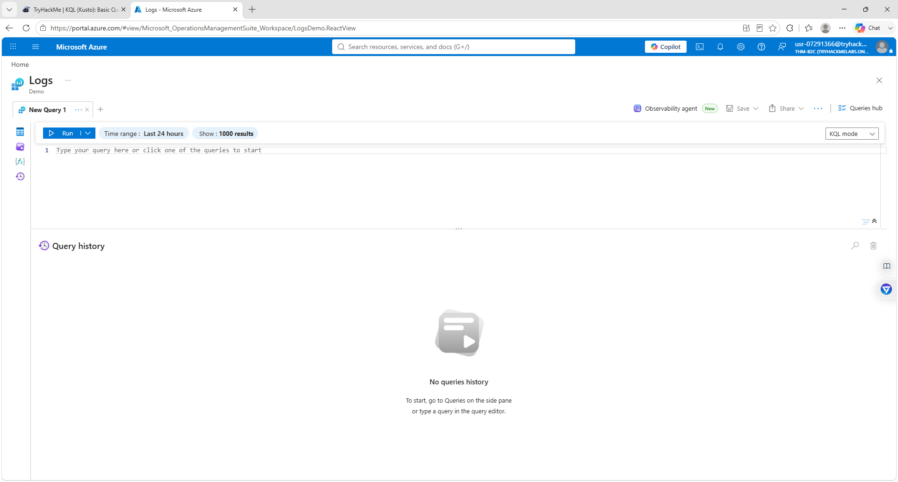
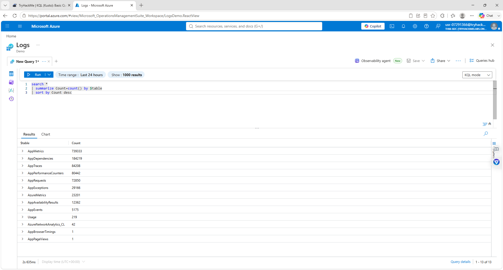
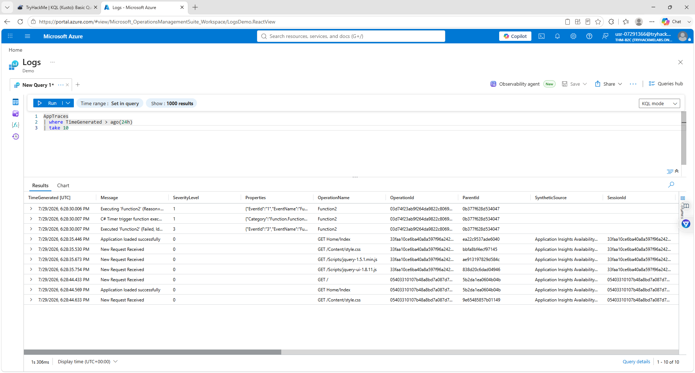
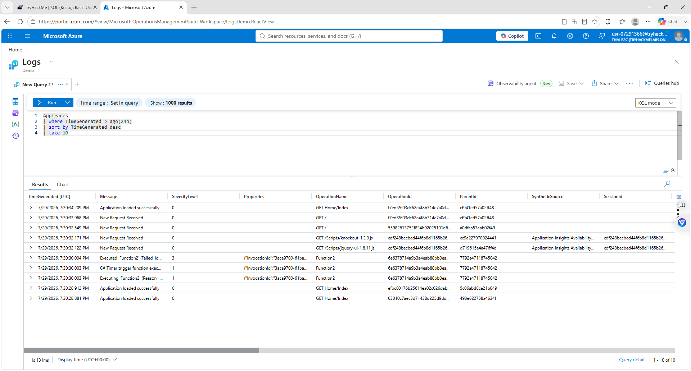
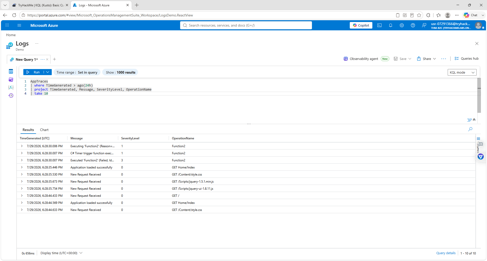
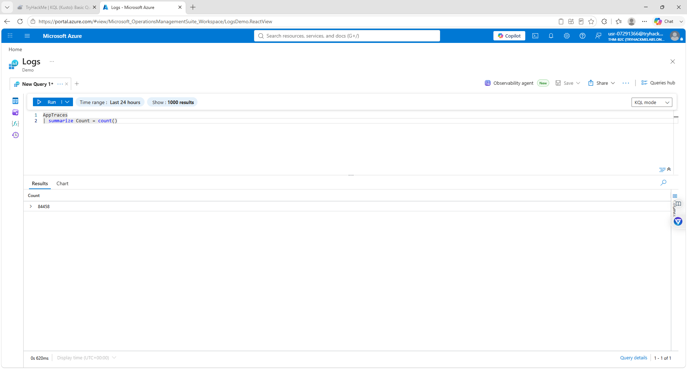
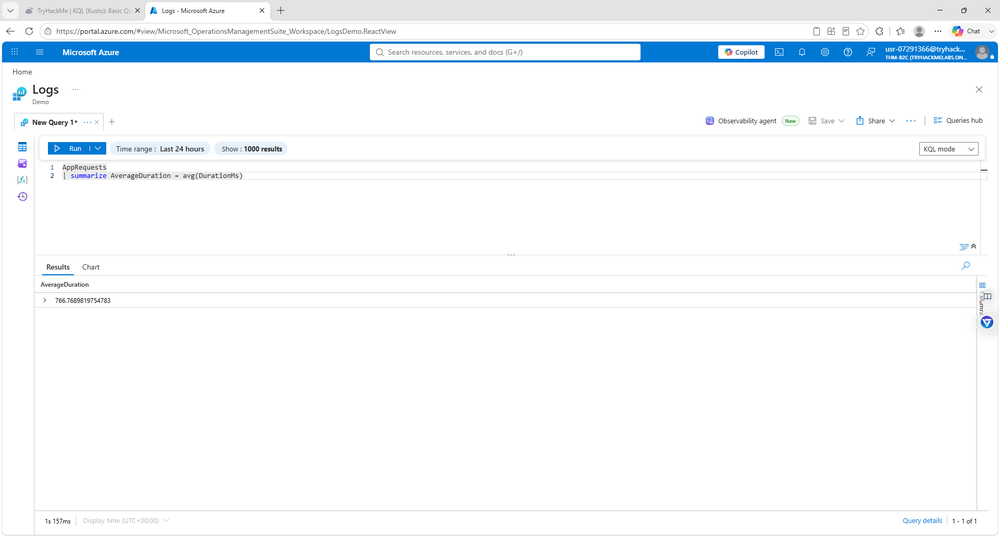

# Darwin-KQL-Basic-Queries-Lab
Completed hands-on KQL basic queries in Microsoft Azure Log Analytics through the TryHackMe KQL lab. Demonstrated search, where, sort, project, summarize, count, and avg operators. Some TryHackMe lab tabs did not display correctly, so equivalent queries were completed manually in Azure Portal to finish the exercises.
## Repository Description

Completed hands-on KQL basic queries in Microsoft Azure Log Analytics through the TryHackMe KQL lab. Demonstrated search, where, sort, project, summarize, count, and avg operators. Due to a TryHackMe interface issue, several queries were completed manually in Azure Portal to finish the lab.

---

## Skills Demonstrated

- Kusto Query Language (KQL)
- Microsoft Azure Log Analytics
- Azure Monitor
- Log Analysis
- Search Operator
- Where Operator
- Sort Operator
- Project Operator
- Summarize Operator
- Count Aggregation
- Average Aggregation
- Security Event Investigation
- SOC Tier 1 Fundamentals

---

## Technologies Used

- Microsoft Azure
- Azure Log Analytics
- Azure Monitor
- Kusto Query Language (KQL)

---

## 01 – KQL Basic Queries Introduction



Introduces the TryHackMe KQL Basic Queries lab and Microsoft Azure Log Analytics environment.

---

## 02 – KQL Demo Logs Workspace



Connected to the Azure Log Analytics Demo workspace where all KQL queries were executed.

---

## 03 – KQL Available Tables



### Query

```kql
search *
| summarize Count=count() by $table
| sort by Count desc
```

### Purpose

Displays all available log tables in Azure Log Analytics and counts the number of records stored in each table.

---

## 04 – KQL Where Operator Results



### Query

```kql
AppTraces
| where TimeGenerated > ago(24h)
| take 10
```

### Purpose

Filters log entries to display only events generated during the last 24 hours.

---

## 05 – KQL Sort Operator Results



### Query

```kql
AppTraces
| where TimeGenerated > ago(24h)
| sort by TimeGenerated desc
| take 10
```

### Purpose

Sorts the filtered results from newest to oldest before displaying the first ten records.

---

## 06 – KQL Project Operator



### Query

```kql
AppTraces
| where TimeGenerated > ago(24h)
| project TimeGenerated, Message, SeverityLevel, OperationName
| take 10
```

### Purpose

Displays only the columns needed for analysis, making the results easier to read.

---

## 07 – KQL Summarize Operator


### Query

```kql
search *
| summarize Count=count() by $table
| sort by Count desc
```

### Purpose

Uses the **summarize** operator with the **count()** aggregation function to calculate how many records exist in each Azure Log Analytics table.

---

## 08 – KQL Count Aggregation



### Query

```kql
AppTraces
| summarize Count = count()
```

### Purpose

Calculates the total number of records stored in the **AppTraces** table using the **count()** aggregation function.

---

## 09 – KQL Average Aggregation



### Query

```kql
AppRequests
| summarize AverageDuration = avg(DurationMs)
```

### Purpose

Calculates the average application request duration (milliseconds) using the **avg()** aggregation function.

### Purpose

Calculates the average application request duration (milliseconds) using the **avg()** aggregation function.

---

# What I Learned

- Navigated Microsoft Azure Log Analytics.
- Queried application and log data using KQL.
- Used the **search** operator to explore available log data.
- Filtered events using the **where** operator.
- Sorted results with **sort by**.
- Displayed selected fields using the **project** operator.
- Summarized log data using the **summarize** operator.
- Used **count()** to calculate totals.
- Used **avg()** to calculate averages.
- Performed basic log analysis similar to real SOC Tier 1 investigations.
- Worked around a TryHackMe interface issue by manually executing KQL queries directly in Azure Log Analytics.

- Author: Darwin Brown JR.
- Aspiring SOC Tier 1
